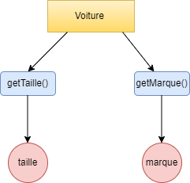

# TCC *vs* LCC

Explain under which circumstances *Tight Class Cohesion* (TCC) and *Loose Class Cohesion* (LCC) metrics produce the same value for a given Java class. Build an example of such as class and include the code below or find one example in an open-source project from Github and include the link to the class below. Could LCC be lower than TCC for any given class? Explain.

## Answer

### Explain under which circumstances Tight Class Cohesion (TCC) and Loose Class Cohesion (LCC) metrics produce the same value for a given Java class.

Cohesion metrics measure how well the methods of a class are related to each other. A cohesive class performs one function. A non-cohesive class performs two or more unrelated functions. A non-cohesive class may need to be restructured into two or more smaller classes.

The assumption behind the following cohesion metrics is that methods are related if they work on the same class-level variables. Methods are unrelated if they work on different variables altogether. In a cohesive class, methods work with the same set of variables. In a non-cohesive class, there are some methods that work on different data.

LCC tells the overall connectedness while TCC tells the connection density, but, the produce the same class for a given Java class when : 
- **TCC=0** and **LCC=0**, the class is totally non-cohesive and all the methods are totally unconnected,
- **TCC=LCC=1** is the maximally cohesive class where all methods are directly connected to each other.


### Build an example of such a class and include the code below or find an example in an open-source project on Github and include the link to the class below

```
public class Voiture {
	int taille;							
	String marque;
	
	public int getTaille() {
		return taille;
	}
	public String getMarque() {
		return marque;
	}	
}

```



We notice that the methods of the Car class are not connected to each other so the class is not cohesive which means that LCC= TCC = 0

### Could LCC be lower than TCC for any given class? Explain.

TCC and LCC formula

NP = N×(N−1) 2 : maximum number of possible connections where N is the number of visible methods ,  NDC: number of direct connections 
NIC: number of indirect connections

TCC = NDC /  NP
LCC = NDC+NIC /  NP

We think that LCC cannot be smaller than TCC because already by definition LCC > TCC also given the formula of LCC we notice that whatever the class, LCC takes its value in the range [0, 1]. So everything depends on NIC if it is equal LCC will be the same as TCC otherwise LCC will always be higher than TCC


